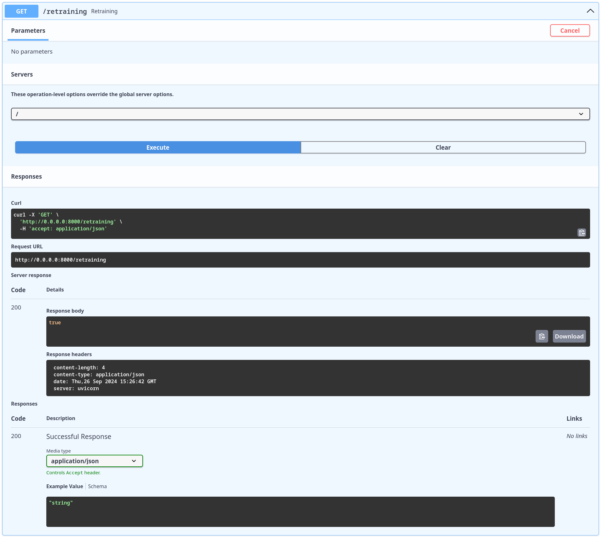
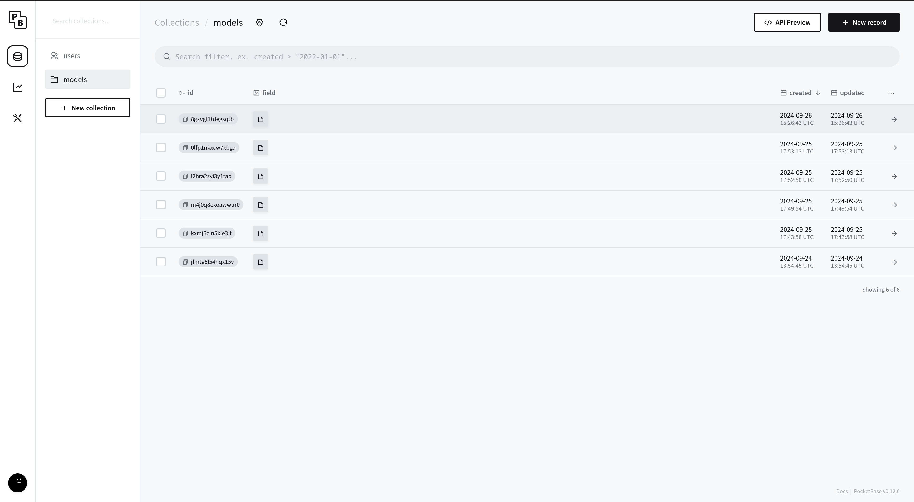

# Criação do backend

## FastAPI

Para implementar o backend da aplicação, foi utilizado o **FastAPI**, uma biblioteca moderna e eficiente para a construção de APIs em Python. Essa escolha se deve a várias razões:

1. **Desempenho**: O FastAPI foi construído com base no ASGI (Asynchronous Server Gateway Interface), o que o torna extremamente rápido e eficiente, ideal para aplicações que precisam lidar com requisições de IA em tempo real.
2. **Documentação Automática**: Ele gera automaticamente a documentação da API usando ferramentas como Swagger e Redoc, o que facilita o desenvolvimento e a manutenção da aplicação.
3. **Tipagem**: O FastAPI utiliza a tipagem do Python, proporcionando segurança em tempo de desenvolvimento e permitindo a validação de dados automática, o que reduz a necessidade de validação manual.
4. **Suporte para WebSockets e Streaming**: Além das requisições HTTP padrão, o FastAPI suporta WebSockets e streaming de dados, que podem ser úteis em aplicações de IA que precisam monitorar dados em tempo real.
5. **Facilidade de Integração**: A integração com bancos de dados, como o **Pocketbase**, e o uso de ferramentas de machine learning são simples e diretas devido à natureza modular e orientada a objetos do FastAPI.

## Comunicação com a IA 

A primeira etapa foi a criação da rota principal da aplicação, responsável pela previsão de preços utilizando a IA. Essa rota faz a previsão para os próximos 10 dias e destaca os dias em que o preço da ação está mais baixo e mais alto, fornecendo recomendações sobre o melhor momento para comprar e vender.

A escolha de 10 dias foi feita com base no comportamento dos modelos de séries temporais, que tendem a perder precisão quanto mais distante é o horizonte de previsão. Dessa forma, para manter a confiabilidade dos resultados, foi definido que 10 dias seria o limite máximo para as previsões.

Essa função chama o último modelo que foi inserido no **pocketbase** de forma automatizada e retorna a lista das predições, juntamente ao valor mais baixo e o valor mais alto.


Response Body:

```Json
{
  "predicted_values": [
    {
      "ds": "2024-05-27T00:00:00",
      "yhat": 0.11458711248694763
    },
    {
      "ds": "2024-05-28T00:00:00",
      "yhat": 0.11424653295612622
    },
    {
      "ds": "2024-05-29T00:00:00",
      "yhat": 0.11439307297129908
    },
    {
      "ds": "2024-05-30T00:00:00",
      "yhat": 0.1140978935353363
    },
    {
      "ds": "2024-05-31T00:00:00",
      "yhat": 0.11471204649674535
    },
    {
      "ds": "2024-06-01T00:00:00",
      "yhat": 0.11396011855807467
    },
    {
      "ds": "2024-06-02T00:00:00",
      "yhat": 0.11411733414468285
    },
    {
      "ds": "2024-06-03T00:00:00",
      "yhat": 0.11464147880367416
    },
    {
      "ds": "2024-06-04T00:00:00",
      "yhat": 0.11430089927285203
    },
    {
      "ds": "2024-06-05T00:00:00",
      "yhat": 0.11444743928802749
    }
  ],
  "lowest_value": 0.11396011855807467,
  "highest_value": 0.11471204649674535
} 
```

## Pipeline de Retreinamento

Como mencionado anteriormente, a precisão dos modelos de séries temporais tende a diminuir conforme o horizonte de previsão se estende. Por isso, não faz sentido utilizar um modelo de previsão que foi treinado há um mês. Pensando nisso, foi criada uma pipeline automatizada de retreinamento que treina o modelo da mesma forma que o original, utilizando o **Prophet**. Essa função repete os passos do treinamento inicial, mas agora com os dados mais recentes da criptomoeda. Após o treinamento, uma função é chamada para inserir o novo modelo no **Pocketbase**. Como a função de previsão já utiliza o modelo mais atualizado presente no **Pocketbase**, não é necessário fazer nenhum outro ajuste para começar a usar o novo modelo.





Na imagem acima, é possível ver que o último dado inserido (do dia 26 de setembro de 2024) corresponde ao novo modelo treinado.