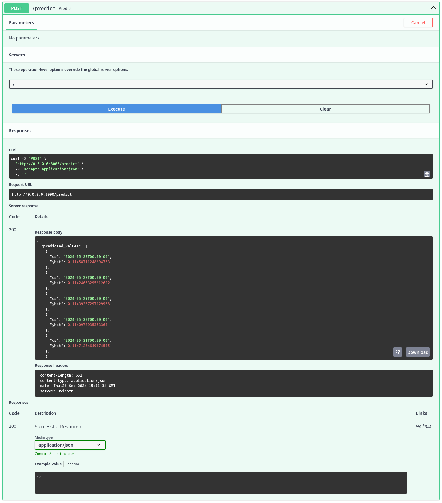

# Criação do backend

## Comunicação com a IA

A primeira etapa foi a criação da rota principal da aplicação, responsável pela previsão de preços utilizando a IA. Essa rota faz a previsão para os próximos 10 dias e destaca os dias em que o preço da ação está mais baixo e mais alto, fornecendo recomendações sobre o melhor momento para comprar e vender.

A escolha de 10 dias foi feita com base no comportamento dos modelos de séries temporais, que tendem a perder precisão quanto mais distante é o horizonte de previsão. Dessa forma, para manter a confiabilidade dos resultados, foi definido que 10 dias seria o limite máximo para as previsões.

