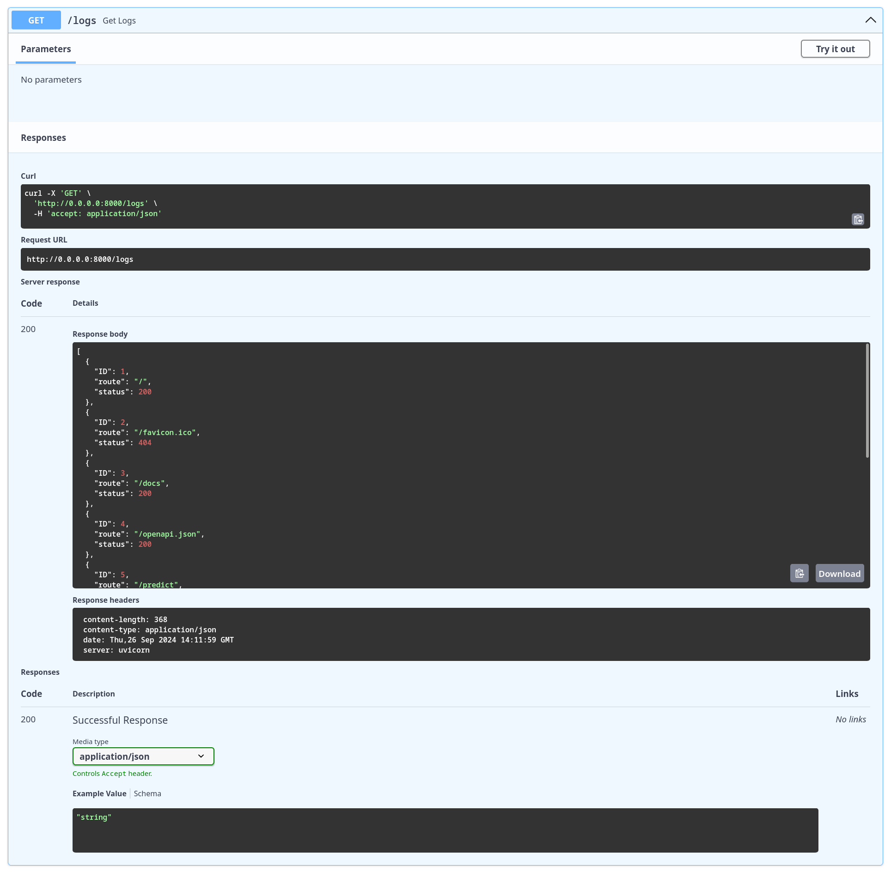

# Documentação da Criação de Logs

## 1. Como foi feito

Os logs estão sendo armazenados em um banco de dados **PostgreSQL**, uma escolha robusta para sistemas de produção devido à sua confiabilidade, suporte a transações e capacidade de lidar com grandes volumes de dados. Com o middleware, cada requisição feita à API é registrada automaticamente na tabela de logs.

## 2. Banco de Dados

O banco de dados escolhido foi o **PostgreSQL** por suas vantagens de ser um sistema de gerenciamento de banco de dados relacional (RDBMS) de código aberto, altamente escalável, e com excelente suporte a operações ACID (Atomicidade, Consistência, Isolamento e Durabilidade). Além disso, ele é amplamente utilizado por empresas em todo o mundo, o que o torna uma opção confiável e estável para o armazenamento de dados críticos.

A modelagem da tabela de logs foi feita utilizando o **SQLAlchemy**, um ORM (Object-Relational Mapping) que permite interagir com o banco de dados de maneira mais simples e estruturada. A tabela **Log** foi definida com as seguintes colunas:

- **ID**: Chave primária, auto-incrementável, para identificar cada entrada de log.
- **route**: Um campo de texto que armazena a rota acessada pela requisição.
- **status**: Um número inteiro que registra o código de status da resposta (ex: 200 para sucesso, 404 para não encontrado).

### Modelagem da Tabela de Logs

```python
from sqlalchemy import Column, Integer, String
from models.database import Base

class Log(Base):
    __tablename__ = "Log"
    
    ID = Column(Integer, primary_key=True, autoincrement=True, index=True)
    route = Column(String, nullable=False)  # Armazena a rota acessada
    status = Column(Integer, nullable=False)  # Armazena o código de status
```

Esse modelo foi criado no PostgreSQL e será atualizado conforme as requisições forem realizadas, possibilitando um acompanhamento de todas as interações com a API.

## 3. Rota de Visualização dos Logs

Para visualizar os logs que foram salvos no banco de dados, foi criada uma rota específica utilizando o FastAPI. A rota /logs realiza uma consulta ao banco de dados para retornar todas as entradas de logs registradas. Caso não existam logs, a rota retorna um erro 404 indicando que nenhum log foi encontrado.

